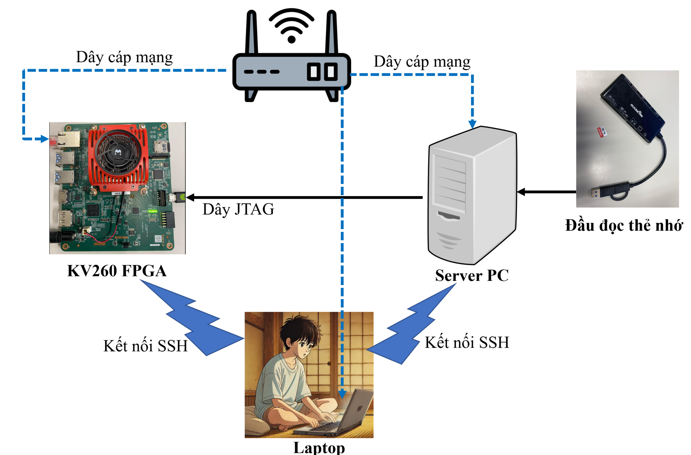
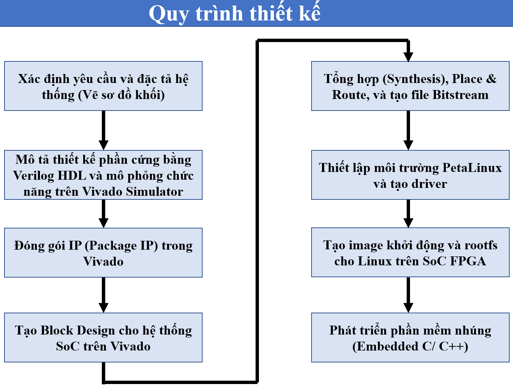
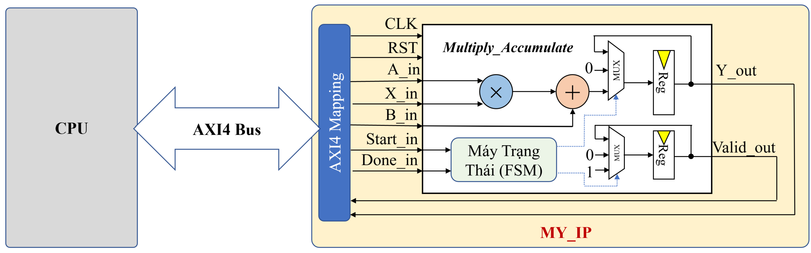

# 🎓 Hardware Design and SoC Systems on FPGA – Level 0 (Kria KV260)

Welcome to **Level 0** in the **Hardware Design and SoC Systems on FPGA** series.  
This repository contains all documentation, source code, and guides related to implementing a simple hardware module and integrating it into an SoC system on the **Xilinx Kria KV260** board.

---
# Detailed Tutorial Video

The steps will be explained in detail in the corresponding tutorial video below. Please click on the video below to view the step-by-step details 👇👇👇.  

[](https://www.youtube.com/watch?v=F1vxzkd7_DI)

Or access the link: https://youtu.be/F1vxzkd7_DI?si=RyHPx3zzii_RXPgk
---

## I. Algorithm Requirements

In this Level 0, we will implement a basic mathematical function:

> **Y = A × X + B**

using the fixed-point Q15.16 format (1-bit sign, 15-bit integer part, 16-bit fractional part) for the operands A, X, B, and the result Y.

- The design must be described using Verilog HDL, controlled via a Finite State Machine (FSM), and use Start, Done, and Valid control signals for integration into the SoC system.

- The communication between the custom IP and the CPU is implemented via PIO (Programmed I/O), meaning the CPU directly writes the values A, X, B to the IP’s control registers and reads the result Y from the registers. PIO is a simple, easy-to-implement communication method but consumes CPU processing time and is not suitable for high-speed data transfers.

⚠️ **Note**: This is a Level 0 design, using only the simple PIO method, without integrating DMA data transfer from DDRAM to the custom IP. DMA will be explored in subsequent levels to improve data transfer performance.

This lesson is designed for beginners in developing SoC systems on FPGA platforms.

---

## II. Required Equipment

### A. List of Equipment:
Below is the list of hardware equipment needed to practice Level 0 on the **Kria KV260 FPGA** board.


- **Kria KV260 FPGA**: The main board used to implement the SoC system and run embedded applications.

- **Ethernet (LAN) cable**: Used to connect the FPGA to the Internet via a router/switch, supporting updates and debugging via SSH.

- **JTAG cable**: Connects the FPGA to the Server PC for loading bitstreams, debugging, or acting as a UART cable to display the Linux console on the FPGA.

- **MicroSD card and card reader**: Used to create a boot image (BOOT.BIN + Linux kernel + rootfs) and install the operating system for the FPGA.

- **Server PC (Linux)**: Used to install hardware design tools (Vivado), PetaLinux tools, and build the entire system.

- **Personal Laptop/PC (Windows or Linux)**: Used to connect to the Server via SSH or transfer files (e.g., via WinSCP). If using Windows, **VMware** must be installed to run Linux.

⚠️ **Note**: You can replace **1 Server PC and 1 Laptop/PC** with **a single Laptop/PC**, as long as it has Linux installed to run PetaLinux.

### B. Equipment Connections

Before starting the hardware design process, connect and set up the equipment as follows:

- **KV260 FPGA**: Connect to the router via an **Ethernet cable** for Internet access, and connect to the Server PC via a **JTAG cable** for loading bitstreams and debugging.
- **Server PC**: Used to install **Vivado** and **PetaLinux**, connected to the network and a card reader to prepare Linux for the FPGA.
- **Laptop**: Used to control the Server PC and KV260 via **SSH connection** (using MobaXterm, VSCode, or Terminal).

⚠️ **Note**:  
- The Server PC and Laptop must be on the same local network (LAN/WiFi).
- The microSD card will be used to load the Linux operating system onto the FPGA.

<p align="center">
  
</p>

## III. Detailed Steps in the Design Process

<p align="center">
  
</p>

The design process for an SoC system on FPGA consists of 8 sequential steps, starting from defining requirements and describing the hardware in Verilog, to packaging the IP, designing the system in Vivado, setting up PetaLinux, and finally developing embedded software to control the designed hardware.

Next, I will explain the 8 steps in detail.

### A. Step 1: Define Requirements and System Specification (Draw Block Diagram)

- Function to implement: **Y = A × X + B**, using the **fixed-point Q15.16** format (1-bit sign, 15-bit integer, 16-bit fractional).
- Create a block diagram including multiplication, addition, registers, and controlled by a **Finite State Machine (FSM)**.
- The FSM includes 3 states: `IDLE`, `EXECUTE`, `WAIT_DONE`, controlled via the `Start_in` and `Done_in` signals.

📌 Main signals:  
`A_in`, `X_in`, `B_in` (inputs), `Y_out`, `Valid_out` (outputs), `Start_in`, `Done_in` (control)


### B. Step 2: Hardware Design Description and Functional Simulation

- Write **Verilog HDL** code to describe the digital circuit implementing the calculation **Y = A × X + B** with the **fixed-point Q15.16** format for operands.
- **RTL Verilog source code** is located in the directory:  
  - `RTL/MAC.v`
  
- Write a **testbench** to simulate **10 test cases** with real values, verifying that the output `Y_out` matches the expected values. Run the simulation using **Vivado Simulator**, observing:
  - Signal waveforms in the waveform viewer
  - Calculation results printed in the console window (PASS/FAIL for each test case)

- **Testbench source code** is located in the directory:  
  - `TB/TB_MAC.v`

- **Vivado Project (2022.2)** pre-configured for simulation is located in the directory:  
  - `Simulation/`

<p align="center">
  
</p>

### C. Step 3: Package IP in Vivado

After successfully describing the hardware in **Verilog HDL** and simulating it, we proceed to **package the design into an IP** for reuse and integration into the SoC system in subsequent steps.

The figure below illustrates how the **custom IP (`MY_IP`)** is integrated into the SoC system and connected to the CPU via the **AXI4 Bus**. The input/output signals of the circuit (`A_in`, `X_in`, `B_in`, `Start_in`, `Done_in`) are mapped through the AXI4-Full interface via the `AXI4 Mapping` layer.

<p align="center">
  
</p>

- Reference material on the **bus system including AXI4-Full** is located in the directory:  
  - `Tai_Lieu_Tham_Khao/Hệ Thống Bus.pdf`
  
Steps to perform:

1. Open Vivado, select the menu **Tools → Create and Package New IP**
2. Choose the IP type: from existing RTL code (`Package your current project`)
3. Enter identification information for the IP:
   - IP name (`MY_IP`)
   - Version (e.g., `1.0`)
   - Functional description (Multiply-Accumulate core with FSM control)
4. Configure the I/O ports and communication address:
   - Map signals to the **AXI4-Full** standard if interfacing with the CPU
5. Review all configurations
6. Click **Package IP** to package and add this IP to the Vivado IP Catalog

> This is a necessary step to reuse the IP in Block Designs.


### D. Step 4: Create Block Design for the SoC System in Vivado

After successfully packaging the IP, we proceed to create the SoC system using **Block Design** in Vivado.

Main components in the Block Design diagram:

- **ZYNQ MPSoC**: The main processor controlling the system, configuring pins and AXI connections.
- **Custom IP (MY_IP_v1_0)**: Contains the MAC function `Y = A * X + B`, connected via the **AXI4-Full** standard.
- **AXI SmartConnect**: Bridges between master/slave components using the AXI protocol.
- **Reset module**: Synchronizes reset signals between processing and programmable parts.

#### Tasks to perform in Vivado:

1. Create a **new Block Design** from the **IP Integrator** menu.
2. Add the main components to the diagram (ZYNQ MPSoC, MY_IP_v1_0, AXI SmartConnect, Reset).
3. Use **Run Block Automation** to automatically configure ZYNQ.
4. Connect the AXI and Reset ports correctly.

<p align="center">
  
</p>

### E. Step 5: Synthesis, Place & Route, and Generate Bitstream

After completing the connection diagram:

1. **Right-click on the Block Design** → select **"Generate Output Products"**.
2. **Right-click again** → select **"Create HDL Wrapper"** to generate the top-level code for the design.
3. Finally, click **"Generate Bitstream"** to run all steps:
   - Synthesis
   - Implementation
   - Bitstream Generation

> This is a critical step to convert the design into a `.bit` configuration file that can be loaded onto the FPGA and a `.xsa` file for PetaLinux setup on the FPGA.

### F. Step 6: Set Up PetaLinux Environment and Create Driver

After completing the hardware design and creating the Block Design in Vivado, the next step is to **export the hardware file (`.xsa`)** for use in PetaLinux to create the operating system and driver suitable for the system.

#### 1. Export the hardware file (`.xsa`) from Vivado

- In Vivado, after successfully **Generating the Bitstream**:
  - Go to the menu: **File → Export → Export Hardware**
  - Select: Include bitstream
  - The `.xsa` file will be generated (e.g., `SoC_wrapper.xsa`)

#### 2. Install PetaLinux

- Download the **PetaLinux 2022.2** installer from the official Xilinx website:
    🔗 https://www.xilinx.com/support/download/index.html/content/xilinx/en/downloadNav/embedded-design-tools/archive.html

##### Installing Dependencies (Ubuntu/Debian)

```bash
sudo apt-get install tofrodos gawk xvfb git libncurses5-dev tftpd zlib1g-dev zlib1g-dev:i386 \
libssl-dev flex bison chrpath socat autoconf libtool texinfo gcc-multilib \
libsdl1.2-dev libglib2.0-dev screen pax libtinfo5 xterm build-essential net-tools
```

##### Grant execution permission to the `.run` file

```bash
chmod +x petalinux-v2022.2-*.run
```

##### Running the installer

```bash
./petalinux-v2022.2-*.run
```

- During the installation, the installer will display license agreements:

- Use PgUp / PgDn to read

- Press q to exit the display

- Press y to agree and continue

#### 3. Build the hardware environment

##### Set up the Petalinux working environment

##### **Source** to the Petalinux installation directory to use the `petalinux-*` commands:
```bash
source <petalinux_install_path>/2022.2/settings.sh
```

##### Download the BSP installer for KV260 FPGA from the Xilinx official website:
🔗 https://www.xilinx.com/support/download/index.html/content/xilinx/en/downloadNav/embedded-design-tools/archive.html

##### Create a PetaLinux project from BSP
```bash
petalinux-create -t ​​project -s <path_to_BSP_file>.bsp --name KV260_Linux
cd KV260_Linux
```

##### Import hardware (.xsa) into project After you export the .xsa file from Vivado (containing the bitstream), use the following command to integrate the hardware into the project:
```bash
petalinux-config --get-hw-description=<path_to_the_hw_description_file>
```
##### Manually configure kernel bootargs After running petalinux-config, the system will open the curses interface for you to configure further. Adjust the kernel bootargs configuration In the configuration window, do the following:

```text
Subsystem AUTO Hardware Settings --->
DTG Settings --->
Kernel Bootargs --->
[ ] generate boot args automatically
(user-defined) user set kernel bootargs
```

Paste the following bootargs into the user set kernel bootargs section:
```bash
earlycon console=ttyPS1,115200 root=/dev/mmcblk1p2 rw rootwait cpuidle.off=1 uio_pdrv_genirq.of_id=generic-uio clk_ignore_unused init_fatal_sh=1 cma=256M
```
📌 This configuration helps boot the device correctly, enable the UIO driver, allocate CMA memory, and keep the clock for the custom IPs in the PL.

##### Edit Device Tree (system-user.dtsi)

To enable Linux to use **custom IP in PL** via `uio` driver, you need to edit the **Device Tree Overlay** file.

In the file in the path `KV260_Linux/project-spec/meta-user/recipes-bsp/device-tree/files/system-user.dtsi`, edit the file to:
```dts
/include/ "system-conf.dtsi"
/ {
amba_pl@0 {
MY_IP@a0000000 {
compatible = "generic-uio";
};
};
};
```
The sample `system-user.dtsi` file is saved in the `KV260_Linux` directory on github.

##### Then build the project

```bash
petalinux-build
```

### G. Step 7: Create boot image and rootfs for Linux on SoC FPGA

After successfully building the project, type this command to package the boot file BOOT.BIN with the appropriate U-Boot for the system.

```bash
petalinux-package --boot --force --u-boot
```
Then plug the SD card into the PC, proceed to partition and format the SD card. **You can follow the detailed instructions in the Video tutorial above ** from minute **53:40 to 1:03:18** at the link below:

📥 [Download the Debian rootfs file here](https://drive.google.com/file/d/1ZcJYuVHpn8ER11nLCjwCUjfc5ykqP0tM/view?usp=sharing)

> This rootfs file contains a pre-configured Debian operating system for the ARM64 architecture, supports the XFCE interface and easily installs additional applications using `apt`.

### H. Step 8: Develop embedded software (Embedded C/ C++)

After fully preparing the Linux operating system on the FPGA, we proceed to run the self-designed IP control embedded program in the **C/C++** language.

#### Code directory
In this GitHub repo, the `Embedded_C_Code` directory contains the entire C source code that controls the IP MAC via PIO communication.

#### How to run

1. Open the **WinSCP** software to connect from your personal computer to the **KV260 FPGA** board (via SSH).

2. **Copy the entire `Embedded_C_Code`** directory from this repo to the `/home/debian/` directory on the KV260.

3. On the terminal (or via MobaXterm), access the copied directory:
```bash
ssh debiang@<KV260 FPGA IP address> (Example 192.168.1.10)
cd Embedded_C_Code
sh run.sh
```
---

# 📬 For any suggestions or to contact to resolve errors when implementing this project, please contact:

- Facebook: [https://www.facebook.com/pham.luan.921/](https://www.facebook.com/pham.luan.921/)
- Email: [luanph@uit.edu.vn](mailto:luanph@uit.edu.vn)

Thank you very much for your companionship and support 🙏
**Wish you a happy and effective FPGA learning!**

If you find the content I share **useful, practical and valuable for learning or research**, you can **support** me a little to give me more motivation to release the next parts with better quality.

👉 **Note:** If you are a **student**, I **do not expect financial support** from you.

As long as you study well, understand the lesson and spread knowledge to those who need it, I'm very happy! 💙

---

Paypal: ....
