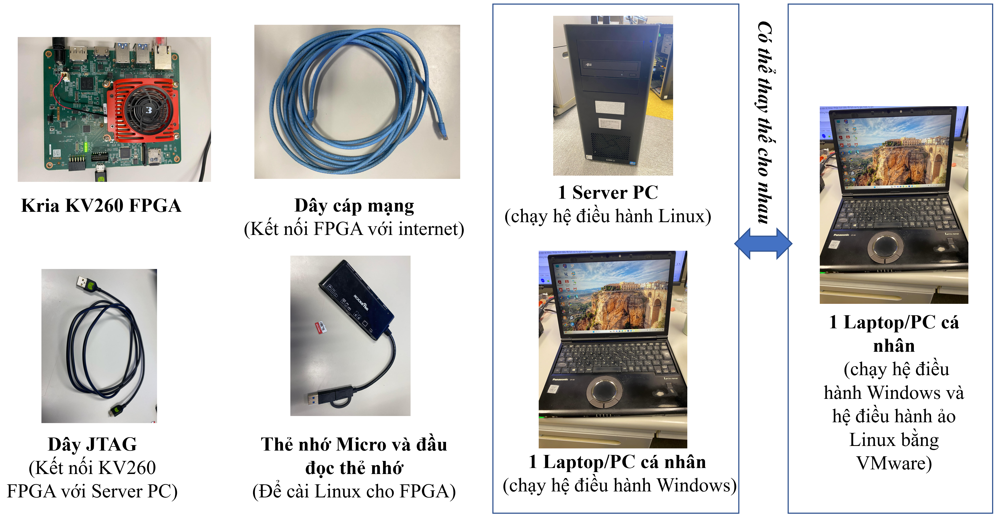
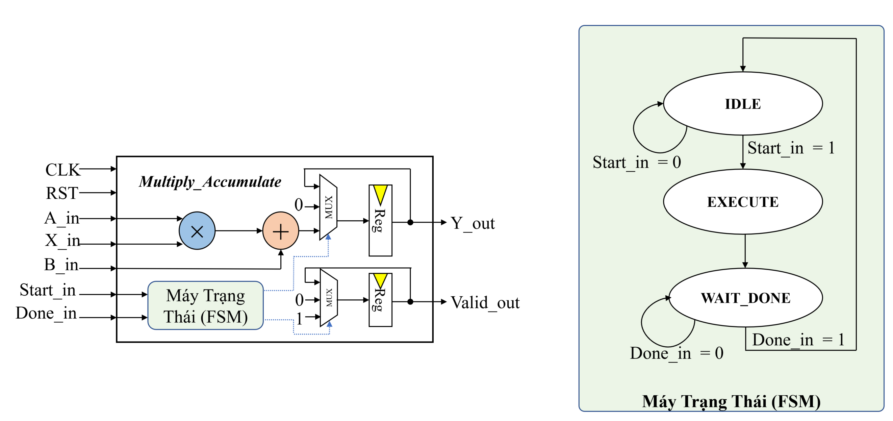
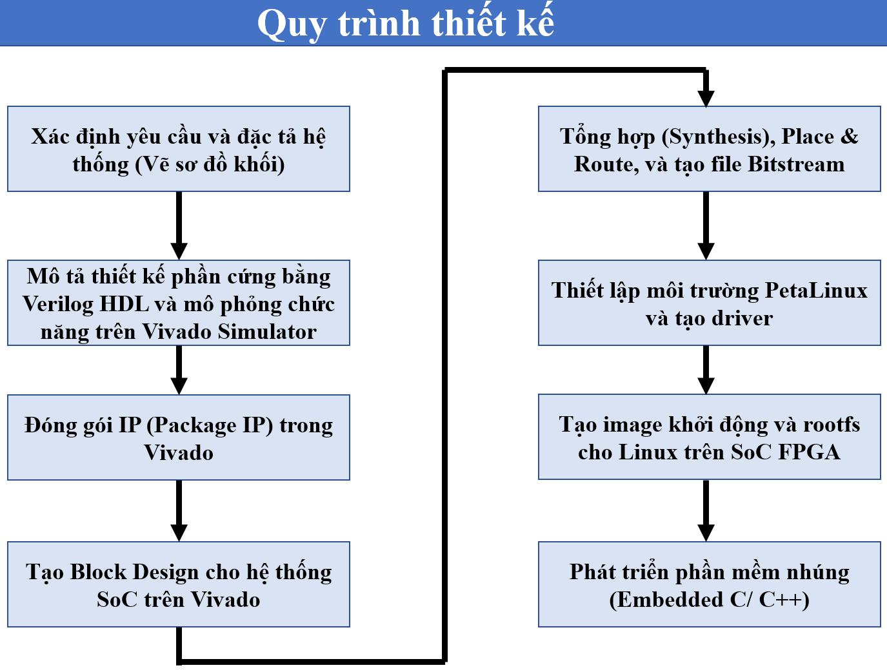
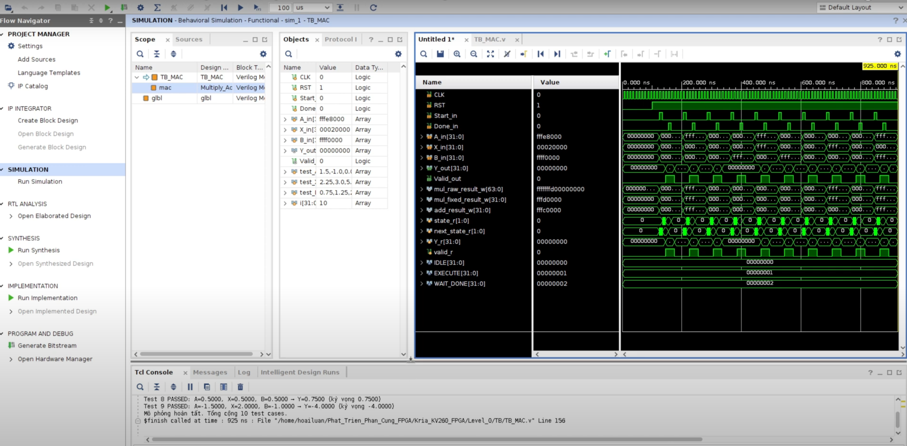
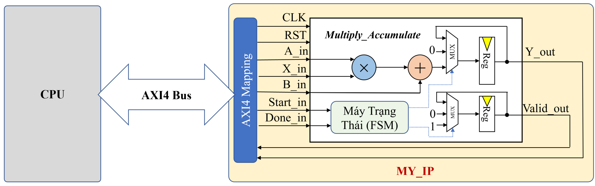
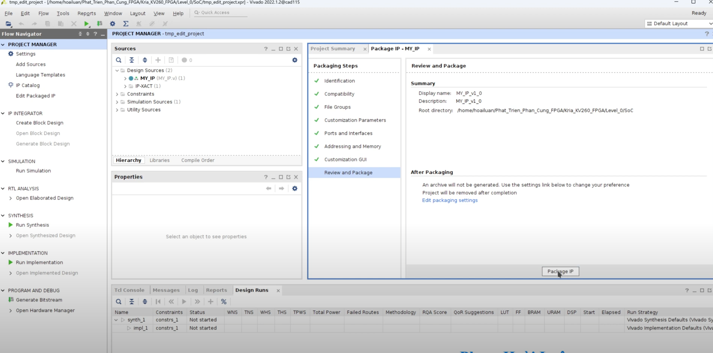
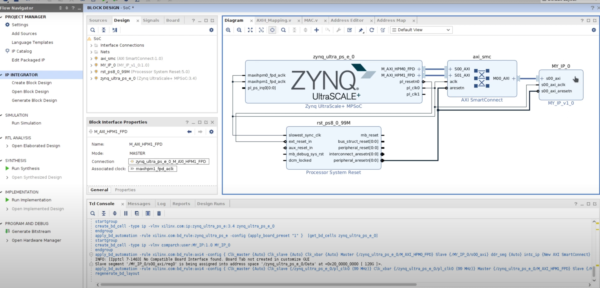

# 🎓 Thiết Kế Phần Cứng và Hệ Thống SoC trên FPGA – Level 0 (Kria KV260)

Chào mừng bạn đến với **Level 0** trong series **Thiết kế phần cứng và hệ thống SoC trên FPGA**.  
Repository này chứa toàn bộ tài liệu, mã nguồn và hướng dẫn liên quan đến việc hiện thực một mô-đun phần cứng đơn giản và tích hợp vào hệ thống SoC trên bo mạch **Xilinx Kria KV260**.

---
# Video hướng dẫn chi tiết

Các bước sẽ được trình bày chi tiết trong video hướng dẫn tương ứng bên dưới, vui lòng bấm vào video bên dưới để xem chi tiết từng bước 👇👇👇.  
 
[](https://www.youtube.com/watch?v=F1vxzkd7_DI)

Hoặc truy cập link: https://youtu.be/F1vxzkd7_DI?si=RyHPx3zzii_RXPgk
---

## I. Yêu cầu thuật toán

Trong Level 0 này, chúng ta sẽ hiện thực hàm toán học cơ bản:

> **Y = A × X + B**

sử dụng chuẩn fixed-point Q15.16 (1-bit dấu, 15-bit biểu diễn phần nguyên, 16-bit biểu dẫn số thập phân) cho các toán hạng A, X, B và kết quả Y. 
	
- Thiết kế cần được mô tả bằng ngôn ngữ Verilog HDL, có điều khiển thông qua Finite State Machine (FSM) và sử dụng các tín hiệu điều khiển Start, Done, và Valid để tích hợp trong hệ thống SoC.
	
- Giao tiếp giữa IP tự thiết kế và CPU được thực hiện thông qua PIO (Programmed I/O), tức là CPU sẽ ghi trực tiếp các giá trị A, X, B vào các thanh ghi điều khiển của IP và đọc kết quả Y cũng qua các thanh ghi. PIO là phương pháp giao tiếp đơn giản, dễ triển khai nhưng tiêu tốn thời gian xử lý của CPU và không phù hợp với truyền dữ liệu tốc độ cao.


⚠️Lưu ý: Đây là thiết kế ở Level 0, chỉ sử dụng phương pháp PIO đơn giản, chưa tích hợp cơ chế truyền DMA từ bộ nhớ DDRAM đến IP tự thiết kế. DMA sẽ được xem xét ở các level tiếp theo để tăng hiệu năng truyền dữ liệu.


Bài học được thiết kế cho những người mới bắt đầu với phát triển hệ thống SoC trên nền FPGA.

---

## II. Thiết cần dùng

### A. Danh sách thiết bị:
Dưới đây là danh sách các thiết bị phần cứng cần chuẩn bị để thực hành Level 0 trên bo mạch **Kria KV260 FPGA**.



- **Kria KV260 FPGA**  
  → Bo mạch chính dùng để triển khai hệ thống SoC và chạy ứng dụng nhúng.

- **Dây cáp mạng (LAN)**  
  → Dùng để kết nối FPGA với Internet thông qua router/switch, hỗ trợ cập nhật và debug qua SSH.

- **Dây JTAG**  
  → Kết nối từ FPGA đến Server PC để nạp bitstream, debug hoặc hoạt động như dây UART để hiện thị console của Linux trên FPGA.

- **Thẻ nhớ MicroSD và đầu đọc thẻ**  
  → Dùng để tạo image khởi động (BOOT.BIN + Linux kernel + rootfs) và cài hệ điều hành cho FPGA.

- **Server PC (Linux)**  
  → Cài đặt công cụ thiết kế phần cứng (Vivado), công cụ PetaLinux, và thực hiện build toàn bộ hệ thống.

- **Laptop/PC cá nhân (Windows hoặc Linux)**  
  → Dùng để kết nối SSH đến Server, hoặc truyền file (WinSCP).  
  → Nếu dùng Windows, cần cài **VMware** để chạy Linux.

⚠️ **Lưu ý:** Bạn có thể thay thế **1 Server PC và 1 Laptop/PC** thành **1 Laptop/PC duy nhất**, miễn là máy có cài đặt Linux để cài PetaLinux.

### B. Kết nối thiết bị

Trước khi bắt đầu quy trình thiết kế phần cứng, cần kết nối và thiết lập các thiết bị như sau:

- **KV260 FPGA**: kết nối với router qua **dây mạng** để có internet, và kết nối với Server PC qua **dây JTAG** để nạp bitstream, debug.
- **Server PC**: dùng để cài **Vivado** và **Petalinux**, kết nối mạng và đầu đọc thẻ nhớ để chuẩn bị Linux cho FPGA.
- **Laptop**: sử dụng để điều khiển Server PC và KV260 thông qua **kết nối SSH** (qua MobaXterm, VSCode, hoặc Terminal).

⚠️ **Lưu ý**:  
- Server PC và Laptop cần nằm chung mạng nội bộ (LAN/WiFi).
- Thẻ nhớ microSD sẽ được dùng để nạp hệ điều hành Linux vào FPGA.

<p align="center">
  
</p>

---

## III. Chi tiết từng bước trong quy trình thiết kế

<p align="center">
  
</p>

Quy trình thiết kế hệ thống SoC trên FPGA gồm 8 bước tuần tự, bắt đầu từ việc xác định yêu cầu và mô tả phần cứng bằng Verilog, đến đóng gói IP, thiết kế hệ thống trên Vivado, thiết lập PetaLinux, và cuối cùng là phát triển phần mềm nhúng để điều khiển phần cứng đã thiết kế.

Kế tiếp tôi sẽ trình bày chi tiết 8 bước trên.

### A. Bước 1: Xác định yêu cầu và đặc tả hệ thống (vẽ sơ đồ khối)

- Hàm cần hiện thực: **Y = A × X + B**, dùng chuẩn số **fixed point Q15.16** ( 1 bit dấu, 15 bit số nguyên, 16 bit thập phân).
- Xây dựng sơ đồ khối gồm các khối nhân, cộng, thanh ghi và điều khiển bởi **FSM (Finite State Machine)**.
- FSM gồm 3 trạng thái: `IDLE`, `EXECUTE`, `WAIT_DONE`, điều khiển thông qua tín hiệu `Start_in` và `Done_in`.

📌 Tín hiệu chính:  
`A_in`, `X_in`, `B_in` (đầu vào), `Y_out`, `Valid_out` (đầu ra), `Start_in`, `Done_in` (điều khiển)



### B. Bước 2: Mô tả thiết kế phần cứng và mô phỏng chức năng

- Viết mã **Verilog HDL** mô tả mạch số thực hiện phép tính **Y = A × X + B** với chuẩn **fixed-point Q15.16** cho các toán hạng.
- **Mã nguồn RTL Verilog** được đặt trong thư mục:  
  - `RTL/MAC.v`
  
- Viết **testbench** để mô phỏng **10 test case** với các giá trị thực (real), kiểm tra đầu ra `Y_out` có khớp với giá trị mong đợi. Chạy mô phỏng bằng **Vivado Simulator**, quan sát:
  - Dạng sóng tín hiệu trên waveform
  - Kết quả tính toán in ra cửa sổ console (PASS/FAIL từng test case)

- **Mã nguồn testbench** được đặt trong thư mục:  
  - `TB/TB_MAC.v`

- **Project Vivado (2022.2)** đã cấu hình sẵn cho mô phỏng nằm trong thư mục:  
  - `Simulation/`

<p align="center">
  
</p>

### C. Bước 3: Đóng gói IP (Package IP) trong Vivado

Sau khi mô tả phần cứng bằng **Verilog HDL** và mô phỏng thành công, chúng ta tiến hành **đóng gói thiết kế thành một IP** để có thể tái sử dụng và tích hợp vào hệ thống SoC trong các bước tiếp theo.

Hình dưới minh họa cách **IP tự thiết kế (`MY_IP`)** được tích hợp vào hệ thống SoC và kết nối với CPU thông qua **AXI4 Bus**. Tín hiệu đầu vào/ra của mạch (`A_in`, `X_in`, `B_in`, `Start_in`, `Done_in`) được ánh xạ qua giao diện AXI4-Full thông qua lớp `AXI4 Mapping`.

<p align="center">
  
</p>

- ✅ Tham khảo nội dung về **hệ thống bus bao gồm AXI4-Full** ở thư mục :  
  - `Tai_Lieu_Tham_Khao/Hệ Thống Bus.pdf`
  
Các bước thực hiện:

1. Mở Vivado, chọn menu **Tools → Create and Package New IP**
2. Chọn kiểu IP: từ mã RTL có sẵn (`Package your current project`)
3. Điền thông tin định danh cho IP:
   - Tên IP (`MY_IP`)
   - Phiên bản (ví dụ: `1.0`)
   - Mô tả chức năng (Multiply-Accumulate core with FSM control)
4. Cấu hình các cổng tín hiệu I/O và địa chỉ giao tiếp:
   - Mapping tín hiệu qua chuẩn **AXI4-Full** nếu dùng giao tiếp với CPU
5. Kiểm tra lại toàn bộ cấu hình
6. Nhấn **Package IP** để đóng gói và thêm IP này vào Vivado IP Catalog

> Đây là bước cần thiết để có thể sử dụng lại IP trong các Block Design.



### D. Bước 4: Tạo Block Design cho hệ thống SoC trên Vivado

Sau khi đóng gói IP thành công, ta tiến hành tạo hệ thống SoC bằng cách sử dụng **Block Design** trong Vivado.

Các thành phần chính trong sơ đồ Block Design:

- **ZYNQ MPSoC**: bộ xử lý chính điều khiển hệ thống, cấu hình chân và kết nối AXI.
- **IP tự thiết kế (MY_IP_v1_0)**: chứa hàm MAC `Y = A * X + B`, được kết nối thông qua chuẩn **AXI4-Full**.
- **AXI SmartConnect**: cầu nối giữa các master/slave sử dụng giao thức AXI.
- **Reset module**: đồng bộ hóa tín hiệu reset giữa phần xử lý và phần lập trình.

#### Các thao tác cần thực hiện trong Vivado:

1. Tạo **Block Design mới** từ menu **IP Integrator**.
2. Thêm các thành phần chính vào sơ đồ (ZYNQ MPSoC, MY_IP_v1_0, AXI SmartConnect, Reset).
3. Dùng **Run Block Automation** để tự động cấu hình ZYNQ.
4. Kết nối các cổng AXI và Reset đúng cách.

<p align="center">
  
</p>

### E. Bước 5: Tổng hợp (Synthesis), Place & Route, và tạo file Bitstream

Sau khi hoàn tất sơ đồ kết nối:

5. **Chuột phải vào Block Design** → chọn **"Generate Output Products"**.
6. **Chuột phải lần nữa** → chọn **"Create HDL Wrapper"** để sinh mã top-level cho thiết kế.
7. Cuối cùng, nhấn **"Generate Bitstream"** để chạy toàn bộ các bước:
   - Synthesis (tổng hợp)
   - Implementation (triển khai)
   - Bitstream Generation (tạo file cấu hình FPGA)

> 🧠 Đây là bước quan trọng để chuyển thiết kế thành file cấu hình `.bit` có thể nạp lên FPGA và file `.xsa` để cài đặt Petalinux cho FPGA.


### F. Bước 6: Thiết lập môi trường PetaLinux và tạo driver

Sau khi hoàn tất thiết kế phần cứng và tạo Block Design trong Vivado, bước tiếp theo là **xuất file phần cứng (`.xsa`)** để sử dụng trong PetaLinux nhằm tạo hệ điều hành và driver phù hợp cho hệ thống.

#### 1. Xuất file phần cứng (`.xsa`) từ Vivado

- Trong Vivado, sau khi **Generate Bitstream** thành công:
  - Vào menu: **File → Export → Export Hardware**
  - Chọn:Include bitstream
  - File `.xsa` sẽ được tạo ra (ví dụ: `SoC_wrapper.xsa`)

#### 2. Cài đặt PetaLinux

- Tải bộ cài **PetaLinux 2022.2** từ trang chính thức Xilinx:
    🔗 https://www.xilinx.com/support/download/index.html/content/xilinx/en/downloadNav/embedded-design-tools/archive.html


##### Cài đặt các gói phụ thuộc (Ubuntu/Debian)

<pre>
```bash
sudo apt-get install tofrodos gawk xvfb git libncurses5-dev tftpd zlib1g-dev zlib1g-dev:i386 \
libssl-dev flex bison chrpath socat autoconf libtool texinfo gcc-multilib \
libsdl1.2-dev libglib2.0-dev screen pax libtinfo5 xterm build-essential net-tools
</pre>
	
##### Cấp quyền thực thi cho file `.run`

<pre>
```bash
chmod +x petalinux-v2022.2-*.run	
</pre>	

#####  Chạy trình cài đặt

<pre>
```bash
./petalinux-v2022.2-*.run
</pre>	

Trong quá trình cài đặt, trình cài đặt sẽ hiển thị các thỏa thuận bản quyền:
	- Dùng PgUp / PgDn để đọc
	- Nhấn q để thoát khỏi phần hiển thị
	- Nhấn y để đồng ý và tiếp tục

### G. Bước 7: Tạo image khởi động và rootfs cho Linux trên SoC FPGA

Đang soạn nội dung.....

### H. Bước 8: Phát triển phần mềm nhúng (Embedded C/ C++)

Đang soạn nội dung.....

---

# 📬 Mọi góp ý hoặc liên hệ:

- Facebook: [https://www.facebook.com/pham.luan.921/](https://www.facebook.com/pham.luan.921/)
- Email: [luanph@uit.edu.vn](mailto:luanph@uit.edu.vn)

Rất cảm ơn sự đồng hành và ủng hộ của bạn 🙏  
**Chúc bạn học FPGA thật vui và hiệu quả!**

Nếu bạn thấy nội dung mình chia sẻ **hữu ích, thực tế và có giá trị học tập hoặc nghiên cứu**, bạn có thể **ủng hộ** mình một chút để tiếp thêm động lực ra những phần tiếp theo chất lượng hơn.

👉 **Lưu ý:** Nếu bạn là **sinh viên**, mình **không mong chờ sự ủng hộ tài chính** từ bạn đâu.  
Chỉ cần bạn học tốt, hiểu bài và lan tỏa kiến thức đến những người cần là mình đã rất vui rồi! 💙

---

<p align="center">
  
</p>